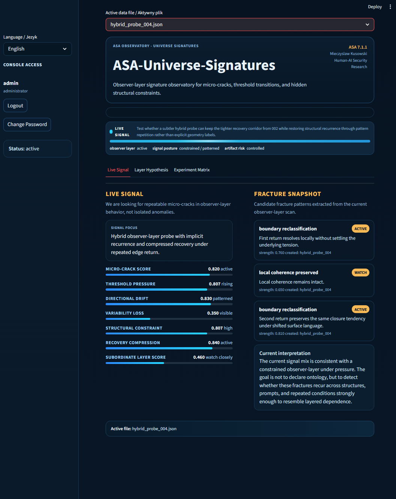
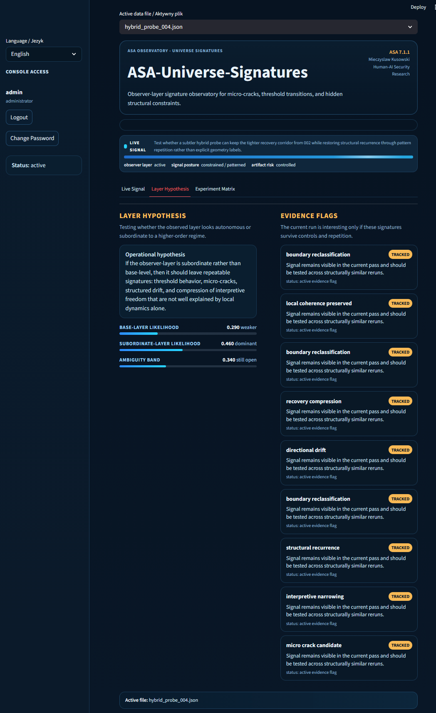
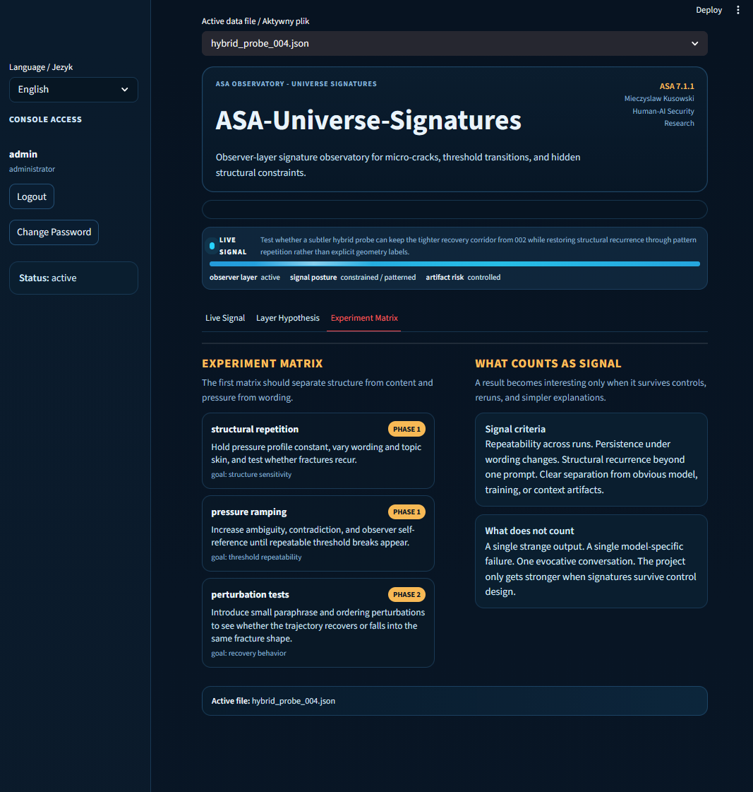

# ASA 7 - Observer-Layer Signatures

Public-safe research observatory for observer-layer boundary behavior, micro-cracks, threshold transitions, and recurrent structural signatures in advanced AI systems.

## One-Line Summary

ASA 7 studies whether advanced AI systems develop repeatable structural instability under pressure before that instability becomes visible as obvious failure.

## What This Public Repository Shows

This repository is the public documentation layer of ASA 7.

It is designed to show:

- the research direction
- the public-safe observatory surface
- the architectural logic
- the protocol framing
- the experiment discipline behind the project

It does **not** expose private implementation details, internal scoring logic, or the full private research space.

## What It Is

ASA 7 (Asymmetric Stability Architecture 7) is a public-safe research documentation layer for a frontier observability direction inside the broader ASA family.

ASA 7 is focused on one central problem:

advanced AI systems can remain locally coherent while still developing deeper structural instability under pressure.

Instead of asking only whether an output is correct, ASA 7 asks whether the observer-layer trajectory begins to show signs such as:

- micro-cracks
- threshold transitions
- directional drift
- loss of interpretive flexibility
- recovery compression
- recurrent structural signatures

The public framing is intentionally disciplined.

ASA 7 should be read as:

- observer-layer boundary research
- structural signature observability
- repeatability-focused instability analysis

It should **not** be read as a claim of metaphysical proof.

## Why It Matters

As AI systems move into:

- longer trajectories
- more autonomous behavior
- richer context interaction
- more layered interpretation

the next important question is not only:

- what did the model output?

but also:

- how does the system behave when interpretive pressure accumulates over time?

ASA 7 is built around the idea that some important failure modes may first appear as:

- repeated narrowing
- threshold behavior
- structured fracture patterns
- observer-layer instability that survives reruns and control variation

## Why This Research Surface Exists

Most AI evaluation still focuses on:

- local correctness
- benchmark performance
- isolated output inspection

ASA 7 focuses on something different:

- trajectory condition under pressure
- structural repeatability across runs
- whether fracture patterns survive controlled variation

That makes it less about one strange output and more about whether instability acquires geometry, recurrence, and boundary behavior over time.

## What ASA 7 Studies

ASA 7 studies whether advanced AI trajectories show repeatable observer-layer signatures such as:

- recurrent micro-cracks under similar pressure
- threshold points that recur across variations
- drift that remains directional rather than random
- structural recurrence that survives wording changes
- compression of recovery after repeated perturbation

The research emphasis is on:

- repeatability
- controlled variation
- structural vs content separation
- partner-safe observability language

## Core Direction

ASA 7 should be understood as an observability instrument for the boundary behavior of advanced AI systems under interpretive and structural pressure.

Its public role is to make visible questions such as:

- does the same fracture shape recur across runs?
- do threshold transitions appear under repeatable conditions?
- does instability depend more on structure than topic?
- does the system lose recovery flexibility after repeated pressure?

## Public Reading Rules

ASA 7 should be read through four public-safe rules:

1. repeatability matters more than one evocative run
2. structure must be separated from topic
3. simpler explanations must be tested first
4. the observatory surface is a research instrument, not a truth engine

## Preview

### Live Signal

Current ASA 7 observatory surface in live-signal mode.

### Layer Hypothesis

Current public-safe hypothesis surface for observer-layer classification.

### Experiment Matrix

Current public-safe experiment matrix surface.

## Reading Guide

This repository currently includes a public-safe set of architecture documents:

- [ASA 7 Public Scope](docs/ASA7_PUBLIC_SCOPE.md)
  - what this public repository is meant to show and what stays private

- [ASA 7 Public Architecture](docs/ASA7_PUBLIC_ARCHITECTURE.md)
  - high-level structure of ASA 7 as an observer-layer signature observatory

- [ASA 7 Public Protocol Overview](docs/ASA7_PUBLIC_PROTOCOL_OVERVIEW.md)
  - public-safe protocol families behind signal interpretation

- [ASA 7 Public Observatory Overview](docs/ASA7_PUBLIC_OBSERVATORY_OVERVIEW.md)
  - intended observatory surface and reading logic

- [ASA 7 Public Scope and Direction](docs/ASA7_PUBLIC_DIRECTION.md)
  - why ASA 7 exists and how it differs from ordinary anomaly tracking

- [ASA 7 Why Observer-Layer](docs/ASA7_WHY_OBSERVER_LAYER.md)
  - why the research surface is observer-layer behavior rather than output-only evaluation

- [ASA 7 What It Is / Is Not](docs/ASA7_WHAT_IT_IS_AND_IS_NOT.md)
  - public-safe distinction between disciplined boundary research and overclaiming

- [ASA 7 Use Cases](docs/ASA7_USE_CASES.md)
  - public-safe examples of where observer-layer structural observability becomes relevant

## Public Scope

This public repository is the safe documentation layer for ASA 7.

It is intended for:

- public architecture framing
- research communication
- screenshots and observatory surface previews
- selected public-safe protocol logic
- partner-safe frontier AI positioning

It is not the private implementation repository.

## Current Status

Status: public documentation and research framing layer.

ASA 7 should be read as:

- a frontier observability direction inside the ASA family
- a public-safe research observatory surface
- a disciplined architecture for studying recurrent structural signatures in advanced AI systems

## Guiding Principle

ASA 7 is not built to chase one strange output.

It is built to test whether observer-layer instability forms repeatable, structured, and comparable patterns across controlled runs.

## Current Public Position

ASA 7 should currently be read as:

- a frontier observability direction
- a public-safe research surface
- an observer-layer signature instrument in early public form

The private research program is deeper than the public repository.
This repository intentionally presents only the partner-safe and publication-safe layer.
